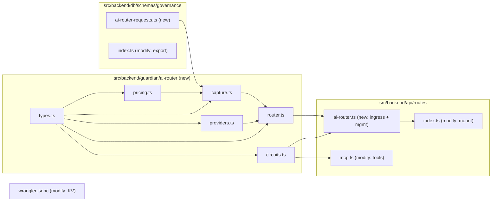
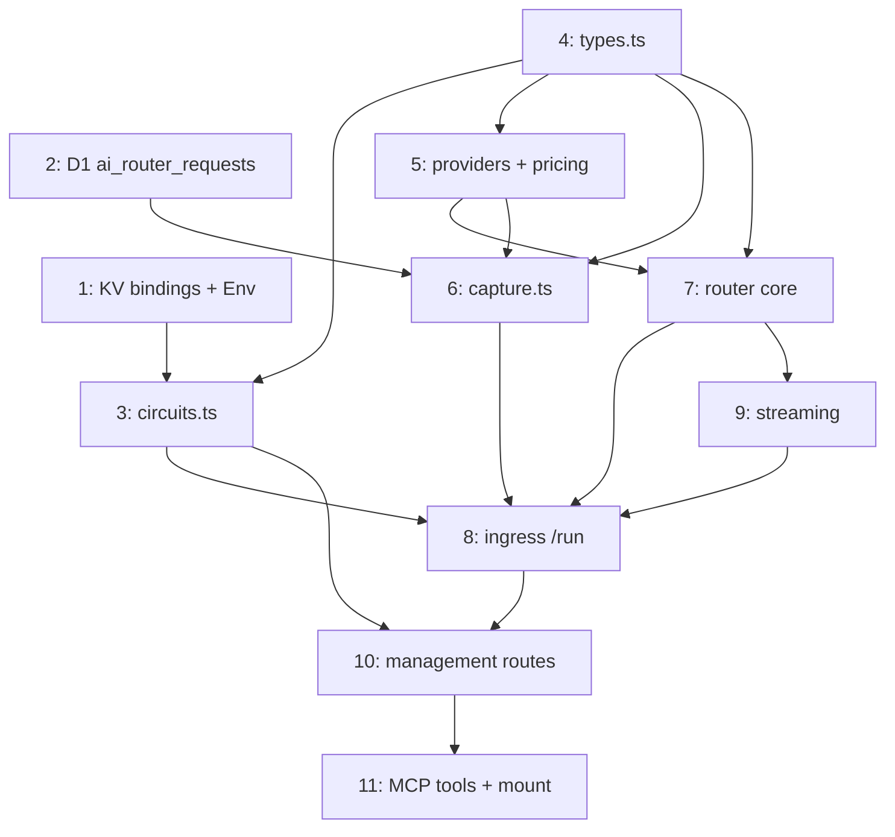

# AI Router — Routing Core Implementation Plan

> **For agentic workers:** REQUIRED SUB-SKILL: Use superpowers:subagent-driven-development (recommended) or superpowers:executing-plans to implement this plan task-by-task. Steps use checkbox (`- [ ]`) syntax for tracking.

**Goal:** Add a single authenticated Worker endpoint (`POST /api/ai-router/run`) that routes every project's AI call through AI Gateway (default `ai-bridge`) or a chosen bypass mode, meters it in KV + D1, and refuses calls that breach a circuit breaker or the global kill switch.

**Architecture:** A new `guardian/ai-router/` module set (types → providers → pricing → circuits → capture → router) behind a Hono route. The route authenticates with `CLOUDFLARE_AI_GATEWAY_TOKEN`, validates required metadata (`project`, `importance`), evaluates breakers pre-flight against the `CIRCUITS` KV, forwards via one of six modes, stores the prompt in `PROMPTS` KV, writes a per-request row to new D1 table `ai_router_requests`, feeds the existing `ai_gateway_costs` roll-up, and increments spend counters. Management routes + MCP tools manage circuits and the kill switch.

**Tech Stack:** Cloudflare Workers, Hono + `@hono/zod-openapi` (Zod v4), Drizzle ORM on D1, Workers KV, Astro SSR (frontend is a later spec). Self-checks via `import.meta.main` run with `bun run`; gate is `pnpm build` + `pnpm lint`.

**Spec:** [2026-08-11-ai-router-1-routing-core-design.md](../specs/2026-08-11-ai-router-1-routing-core-design.md). **Umbrella:** [2026-08-10-ai-router-overview.md](../specs/2026-08-10-ai-router-overview.md).

## Global Constraints

- Zod **v4** only (cloudflare-jedi rule). Routes use `@hono/zod-openapi` `createRoute` + `OpenAPIHono`.
- Drizzle schemas only — **no raw SQL**. Migrations via `pnpm run db:generate` then `pnpm run migrate:remote` (or `migrate:local`). D1 binding name is `DB`.
- Verify every task with `pnpm build` (astro build → typecheck + bundle) and `pnpm lint` (oxlint). **NEVER `pnpm check`** — oxfmt rewrites the whole tree.
- Edit worktree-relative paths only (this is a git worktree).
- Follow existing file conventions: `@fileoverview` header, doc-constant + `createInsertSchema`/`createSelectSchema` for schemas, `import.meta.main` assert-based self-check for pure logic.
- Secrets bound (as **Secret Store** bindings): `CLOUDFLARE_AI_GATEWAY_TOKEN`, `CLOUDFLARE_API_TOKEN`, `OPENAI_API_KEY`, `ANTHROPIC_API_KEY`, `GEMINI_API_KEY`, `CLOUDFLARE_ACCOUNT_ID`, `WORKER_API_KEY`. Do NOT re-add. `SESSIONS` KV belongs to Astro — do not reuse.
- **Secret access:** these are `SecretsStoreSecret` bindings (async `.get()`), NOT strings. Read them via `getSecretStoreBinding(env, "NAME")` (with `getSecret` plain-var fallback) from `@/backend/utils/secrets` — `await` it. NEVER `env.NAME as unknown as string` (returns the binding object, not the value). Any function that reads a secret is therefore async.
- Ingress `/run` is authed by `CLOUDFLARE_AI_GATEWAY_TOKEN` bearer. Management routes are authed by the existing `guardianAuth`.

---

## File structure



**Responsibilities**
- `types.ts` — shared enums + interfaces (no logic).
- `providers.ts` — provider registry, key resolution, usage extraction.
- `pricing.ts` — split in/out USD cost (wraps existing `ai-proxy` price map).
- `circuits.ts` — CIRCUITS KV: criteria CRUD, kill switch, spend counters, pre-flight eval, break-glass, window keys.
- `capture.ts` — request_uuid prompt→KV, D1 row write, `ai_gateway_costs` roll-up feed.
- `router.ts` — mode dispatch + transport + forward + streaming tee.
- `routes/ai-router.ts` — ingress `/run` + management endpoints.

## Task dependency graph



---

### Task 1: KV bindings + Env types

**Files:**
- Modify: `wrangler.jsonc` (add two KV namespaces)
- Modify: `worker-configuration.d.ts` (regenerated)

**Interfaces:**
- Produces: `env.PROMPTS` and `env.CIRCUITS` as `KVNamespace` on the `Env` type.

- [ ] **Step 1: Create the KV namespaces on the account**

```bash
npx wrangler kv namespace create PROMPTS
npx wrangler kv namespace create CIRCUITS
```
Copy each returned `id` into the next step.

- [ ] **Step 2: Add both to `wrangler.jsonc`**

In the existing `"kv_namespaces": [ ... ]` array (where `SESSIONS` already lives), append:
```jsonc
{ "binding": "PROMPTS", "id": "<PROMPTS_id_from_step_1>" },
{ "binding": "CIRCUITS", "id": "<CIRCUITS_id_from_step_1>" }
```

- [ ] **Step 3: Regenerate types**

Run: `npx wrangler types`
Expected: `worker-configuration.d.ts` now declares `PROMPTS: KVNamespace` and `CIRCUITS: KVNamespace` on `Env`.

- [ ] **Step 4: Verify build**

Run: `pnpm build && pnpm lint`
Expected: PASS (no usage yet, just bindings present).

- [ ] **Step 5: Commit**

```bash
git add wrangler.jsonc worker-configuration.d.ts
git commit -m "feat(ai-router): add PROMPTS + CIRCUITS KV namespaces"
```

---

### Task 2: D1 table `ai_router_requests`

**Files:**
- Create: `src/backend/db/schemas/governance/ai-router-requests.ts`
- Modify: `src/backend/db/schemas/governance/index.ts` (add export)
- Migration dir (generated): `drizzle/` or configured `out`

**Interfaces:**
- Produces: `aiRouterRequests` table, `AiRouterRequestRow`, `NewAiRouterRequestRow`, `insertAiRouterRequestSchema`.

- [ ] **Step 1: Write the schema file**

```ts
/**
 * @fileoverview `ai_router_requests` — one immutable row per AI Router call.
 * Superset of ai_usage_registrations: carries project, importance, routing
 * mode, split in/out cost, error + circuit-breaker outcome, and the extra
 * (payloadJson) fields. Prompt bodies live in PROMPTS KV keyed by this id.
 * @see {@link file://src/backend/guardian/ai-router/capture.ts}
 */
import { index, integer, real, sqliteTable, text } from "drizzle-orm/sqlite-core";
import { createInsertSchema, createSelectSchema } from "drizzle-zod";

export const AI_ROUTER_REQUESTS_TABLE_DESCRIPTION =
  "Append-only per-request log for the AI Router: routing mode, project, importance, tokens, split cost, error + circuit-breaker outcome.";

export const AI_ROUTER_REQUESTS_COLUMN_DESCRIPTIONS: Record<string, string> = {
  id: "Request UUID (also the PROMPTS KV key suffix).",
  at: "Unix ms the request was received.",
  project: "Invoking app/worker (required).",
  importance: "low | medium | high — criticality of the call.",
  provider: "Upstream provider (openai, anthropic, google, workers-ai).",
  model: "Model id as billed.",
  mode: "Routing mode used (gateway, native, gemini-native, ...).",
  gateway: "AI Gateway id, or null for bypass modes.",
  tokensIn: "Input tokens.",
  tokensOut: "Output tokens.",
  tokensInCost: "USD cost of input tokens.",
  tokensOutCost: "USD cost of output tokens.",
  costUsd: "tokensInCost + tokensOutCost.",
  isError: "1 = upstream/handler error.",
  errorMessage: "Error text when isError.",
  isCircuitBreaker: "1 = rejected by a breaker/kill switch (no provider call).",
  circuitBrokenMessage: "Which breaker tripped and why.",
  costRowId: "ai_gateway_costs row id this fed.",
  payloadJson: "JSON of non-standard top-level request keys.",
  createdAt: "Unix ms row written.",
};

export const aiRouterRequests = sqliteTable(
  "ai_router_requests",
  {
    id: text("id").primaryKey(),
    at: integer("at").notNull(),
    project: text("project").notNull(),
    importance: text("importance", { enum: ["low", "medium", "high"] }).notNull(),
    provider: text("provider").notNull(),
    model: text("model").notNull(),
    mode: text("mode").notNull(),
    gateway: text("gateway"),
    tokensIn: real("tokens_in").notNull().default(0),
    tokensOut: real("tokens_out").notNull().default(0),
    tokensInCost: real("tokens_in_cost").notNull().default(0),
    tokensOutCost: real("tokens_out_cost").notNull().default(0),
    costUsd: real("cost_usd").notNull().default(0),
    isError: integer("is_error", { mode: "boolean" }).notNull().default(false),
    errorMessage: text("error_message"),
    isCircuitBreaker: integer("is_circuit_breaker", { mode: "boolean" }).notNull().default(false),
    circuitBrokenMessage: text("circuit_broken_message"),
    costRowId: text("cost_row_id"),
    payloadJson: text("payload_json"),
    createdAt: integer("created_at").notNull().$defaultFn(() => Date.now()),
  },
  (t) => [
    index("idx_ai_router_req_project").on(t.project),
    index("idx_ai_router_req_model").on(t.model),
    index("idx_ai_router_req_at").on(t.at),
  ],
);

export const insertAiRouterRequestSchema = createInsertSchema(aiRouterRequests);
export const selectAiRouterRequestSchema = createSelectSchema(aiRouterRequests);
export type AiRouterRequestRow = typeof aiRouterRequests.$inferSelect;
export type NewAiRouterRequestRow = typeof aiRouterRequests.$inferInsert;
```

- [ ] **Step 2: Export from the governance barrel**

In `src/backend/db/schemas/governance/index.ts`, add alongside the other exports:
```ts
export * from "./ai-router-requests";
```
Confirm the top-level `src/backend/db/schema.ts` (or equivalent barrel) re-exports the governance index — if it lists tables explicitly, add `aiRouterRequests` there too.

- [ ] **Step 3: Generate the migration**

Run: `pnpm run db:generate`
Expected: a new migration file containing `CREATE TABLE ai_router_requests` + the three indexes.

- [ ] **Step 4: Apply locally**

Run: `pnpm run migrate:local`
Expected: migration applies with no error.

- [ ] **Step 5: Verify + commit**

Run: `pnpm build && pnpm lint`
```bash
git add src/backend/db drizzle
git commit -m "feat(ai-router): add ai_router_requests D1 table + migration"
```

---

### Task 3: `types.ts` (shared contracts)

**Files:**
- Create: `src/backend/guardian/ai-router/types.ts`

**Interfaces:**
- Produces: `Importance`, `Mode`, `Transport`, `ProviderId`, `RouterRequest`, `Usage`, `PricedUsage`, `Window`, `Circuit`, `BreakerVerdict`, `CircuitScope`.

- [ ] **Step 1: Write the types**

```ts
/** @fileoverview Shared contracts for the AI Router. No logic — types only. */

export type Importance = "low" | "medium" | "high";
export type Mode =
  | "gateway" | "gateway-custom" | "provider-sdk-gateway"
  | "openai-compat" | "native" | "gemini-native";
export type Transport = "ai-sdk" | "provider-sdk" | "openai-compat" | "gemini-sdk";
export type ProviderId = "openai" | "anthropic" | "google" | "workers-ai";
export type Window = "day" | "week" | "month" | "total";

/** A validated ingress request. Unknown extra keys survive in `extra`. */
export interface RouterRequest {
  project: string;
  importance: Importance;
  mode: Mode;
  provider: string;
  model: string;
  aiGatewayId?: string;
  transport?: Transport;
  stream?: boolean;
  providerApiKey?: string;
  input: unknown;
  /** Top-level keys not in the known set — captured to payloadJson. */
  extra: Record<string, unknown>;
}

export interface Usage { tokensIn: number; tokensOut: number; }
export interface PricedUsage extends Usage {
  tokensInCost: number; tokensOutCost: number; costUsd: number;
}

/** Circuit scope string, e.g. "global" | "provider:openai" | "model:openai/gpt-5" | "project:acre". */
export type CircuitScope = string;
export interface Circuit {
  budgetUsd: number; window: Window; enabled: boolean; breakGlassUntil?: number;
}
export interface BreakerVerdict {
  admitted: boolean; scope?: CircuitScope; message?: string;
}
```

- [ ] **Step 2: Verify + commit**

Run: `pnpm build && pnpm lint`
```bash
git add src/backend/guardian/ai-router/types.ts
git commit -m "feat(ai-router): shared types"
```

---

### Task 4: `circuits.ts` (breakers, kill switch, counters)

**Files:**
- Create: `src/backend/guardian/ai-router/circuits.ts`

**Interfaces:**
- Consumes: `Circuit`, `Window`, `BreakerVerdict`, `RouterRequest` from `types.ts`.
- Produces:
  - `windowKey(window: Window, at: number): string`
  - `scopesFor(req: {provider:string; model:string; project:string}): CircuitScope[]`
  - `getKillSwitch(env: Env): Promise<boolean>` / `setKillSwitch(env: Env, on: boolean): Promise<void>`
  - `getCircuit(env, scope): Promise<Circuit|null>` / `setCircuit(env, scope, c): Promise<void>` / `deleteCircuit(env, scope): Promise<void>` / `listCircuits(env): Promise<Array<{scope:string; circuit:Circuit; spent:number}>>`
  - `evaluateBreakers(env, req, now): Promise<BreakerVerdict>`
  - `incrementSpend(env, req, costUsd, now): Promise<void>`
  - `breakGlass(env, scope, hours, now): Promise<void>`

- [ ] **Step 1: Write failing self-check for pure helpers**

Create the file with the pure helpers and an `import.meta.main` block that asserts them; leave KV functions stubbed to throw for now:
```ts
/**
 * @fileoverview AI Router circuit breakers. Criteria + spend counters live in
 * CIRCUITS KV for low-latency pre-flight checks. D1 (ai_router_requests) is the
 * durable trail. Evaluation is hierarchical, first-trip-wins:
 * kill switch → global → provider → model → project.
 */
import type { BreakerVerdict, Circuit, CircuitScope, RouterRequest, Window } from "./types";

const KILL_KEY = "killswitch";

/** UTC window key. week = ISO-8601 `YYYY-Www`. total = "all". */
export function windowKey(window: Window, at: number): string {
  const d = new Date(at);
  const y = d.getUTCFullYear();
  const m = String(d.getUTCMonth() + 1).padStart(2, "0");
  if (window === "total") return "all";
  if (window === "month") return `${y}-${m}`;
  if (window === "day") return `${y}-${m}-${String(d.getUTCDate()).padStart(2, "0")}`;
  // ISO week
  const dt = new Date(Date.UTC(y, d.getUTCMonth(), d.getUTCDate()));
  const day = dt.getUTCDay() || 7;
  dt.setUTCDate(dt.getUTCDate() + 4 - day);
  const yearStart = Date.UTC(dt.getUTCFullYear(), 0, 1);
  const week = Math.ceil(((dt.getTime() - yearStart) / 86_400_000 + 1) / 7);
  return `${dt.getUTCFullYear()}-W${String(week).padStart(2, "0")}`;
}

/** The four scopes a call is evaluated against, broad → narrow. */
export function scopesFor(req: { provider: string; model: string; project: string }): CircuitScope[] {
  return ["global", `provider:${req.provider}`, `model:${req.provider}/${req.model}`, `project:${req.project}`];
}

if (import.meta.main) {
  const eq = (a: unknown, b: unknown, m: string) => { if (a !== b) throw new Error(`${m}: got ${a}, want ${b}`); };
  eq(windowKey("month", Date.UTC(2026, 7, 11)), "2026-08", "month key");
  eq(windowKey("day", Date.UTC(2026, 7, 1)), "2026-08-01", "day key");
  eq(windowKey("total", Date.now()), "all", "total key");
  const s = scopesFor({ provider: "openai", model: "gpt-5", project: "acre" });
  eq(s[0], "global", "scope0"); eq(s[2], "model:openai/gpt-5", "scope2"); eq(s[3], "project:acre", "scope3");
  // eslint-disable-next-line no-console
  console.log("ok — circuits pure helpers verified");
}
```

- [ ] **Step 2: Run self-check, expect FAIL then PASS**

Run: `bun run src/backend/guardian/ai-router/circuits.ts`
Expected: prints `ok — circuits pure helpers verified` (pure helpers already correct). If `bun` is unavailable, skip and rely on `pnpm build`.

- [ ] **Step 3: Implement the KV functions**

Add above the self-check:
```ts
const circuitKey = (scope: CircuitScope) => `circuit:${scope}`;
const spendKey = (scope: CircuitScope, at: number, w: Window) => `spend:${scope}:${windowKey(w, at)}`;

export async function getKillSwitch(env: Env): Promise<boolean> {
  return (await env.CIRCUITS.get(KILL_KEY)) === "on";
}
export async function setKillSwitch(env: Env, on: boolean): Promise<void> {
  await env.CIRCUITS.put(KILL_KEY, on ? "on" : "off");
}
export async function getCircuit(env: Env, scope: CircuitScope): Promise<Circuit | null> {
  return (await env.CIRCUITS.get(circuitKey(scope), "json")) as Circuit | null;
}
export async function setCircuit(env: Env, scope: CircuitScope, c: Circuit): Promise<void> {
  await env.CIRCUITS.put(circuitKey(scope), JSON.stringify(c));
}
export async function deleteCircuit(env: Env, scope: CircuitScope): Promise<void> {
  await env.CIRCUITS.delete(circuitKey(scope));
}
async function readSpend(env: Env, scope: CircuitScope, at: number, w: Window): Promise<number> {
  return Number((await env.CIRCUITS.get(spendKey(scope, at, w))) ?? 0);
}

export async function evaluateBreakers(env: Env, req: RouterRequest, now: number): Promise<BreakerVerdict> {
  if (await getKillSwitch(env)) return { admitted: false, scope: "killswitch", message: "kill switch active" };
  for (const scope of scopesFor(req)) {
    const c = await getCircuit(env, scope);
    if (!c || !c.enabled) continue;
    if (c.breakGlassUntil && c.breakGlassUntil > now) continue;
    const spent = await readSpend(env, scope, now, c.window);
    if (spent >= c.budgetUsd) {
      return { admitted: false, scope, message: `circuit ${scope} over budget: $${spent.toFixed(4)} >= $${c.budgetUsd}` };
    }
  }
  return { admitted: true };
}

export async function incrementSpend(env: Env, req: RouterRequest, costUsd: number, now: number): Promise<void> {
  if (costUsd <= 0) return;
  for (const scope of scopesFor(req)) {
    const c = await getCircuit(env, scope);
    const w: Window = c?.window ?? "month"; // count under the circuit's window, else monthly
    const key = spendKey(scope, now, w);
    const prev = Number((await env.CIRCUITS.get(key)) ?? 0);
    await env.CIRCUITS.put(key, String(prev + costUsd));
  }
}

export async function breakGlass(env: Env, scope: CircuitScope, hours: number, now: number): Promise<void> {
  const c = (await getCircuit(env, scope)) ?? { budgetUsd: Infinity, window: "month" as Window, enabled: true };
  await setCircuit(env, scope, { ...c, breakGlassUntil: now + hours * 3_600_000 });
}

export async function listCircuits(env: Env): Promise<Array<{ scope: string; circuit: Circuit; spent: number }>> {
  const out: Array<{ scope: string; circuit: Circuit; spent: number }> = [];
  const list = await env.CIRCUITS.list({ prefix: "circuit:" });
  const now = Date.now();
  for (const k of list.keys) {
    const scope = k.name.slice("circuit:".length);
    const c = await getCircuit(env, scope);
    if (c) out.push({ scope, circuit: c, spent: await readSpend(env, scope, now, c.window) });
  }
  return out;
}
```

- [ ] **Step 4: Verify + commit**

Run: `pnpm build && pnpm lint` (and `bun run …/circuits.ts` if available)
```bash
git add src/backend/guardian/ai-router/circuits.ts
git commit -m "feat(ai-router): circuit breakers, kill switch, KV spend counters"
```

---

### Task 5: `providers.ts` + `pricing.ts`

**Files:**
- Create: `src/backend/guardian/ai-router/providers.ts`
- Create: `src/backend/guardian/ai-router/pricing.ts`

**Interfaces:**
- Produces (`providers.ts`): `resolveKey(env, provider, override?): string`, `extractUsage(provider, json): Usage`, `PROVIDER_KEY_BINDING: Record<string,string>`, `aigSlug(provider): string`, `nativeBaseUrl(provider): string`.
- Produces (`pricing.ts`): `priceSplit(env, model, usage): Promise<{tokensInCost:number; tokensOutCost:number; costUsd:number}>`.

- [ ] **Step 1: Write `providers.ts` with a self-check for usage extraction + key resolution**

```ts
/** @fileoverview AI Router provider registry: key resolution + usage extraction. */
import { getSecret, getSecretStoreBinding } from "@/backend/utils/secrets";
import type { Usage } from "./types";

export const PROVIDER_KEY_BINDING: Record<string, string> = {
  openai: "OPENAI_API_KEY",
  anthropic: "ANTHROPIC_API_KEY",
  google: "GEMINI_API_KEY",
};

/**
 * Caller-supplied key wins, else the Secret Store binding for the provider.
 * These are `SecretsStoreSecret` bindings (async `.get()`), so this is async —
 * read them via the canonical `getSecretStoreBinding` helper (with the plain-var
 * `getSecret` local-dev fallback), never a string cast.
 */
export async function resolveKey(env: Env, provider: string, override?: string): Promise<string> {
  if (override) return override;
  const binding = PROVIDER_KEY_BINDING[provider];
  const key = binding
    ? (await getSecretStoreBinding(env, binding)) ?? getSecret(env, binding)
    : undefined;
  if (!key) throw new Error(`No API key for provider "${provider}" (no override, no ${binding} binding).`);
  return key;
}

/** Read {tokensIn, tokensOut} from a provider's JSON response. Mirrors ai-proxy.ts. */
export function extractUsage(provider: string, json: any): Usage {
  switch (provider) {
    case "openai":
    case "workers-ai":
      return { tokensIn: json?.usage?.prompt_tokens ?? 0, tokensOut: json?.usage?.completion_tokens ?? 0 };
    case "anthropic":
      return { tokensIn: json?.usage?.input_tokens ?? 0, tokensOut: json?.usage?.output_tokens ?? 0 };
    case "google":
      return {
        tokensIn: json?.usageMetadata?.promptTokenCount ?? 0,
        tokensOut: json?.usageMetadata?.candidatesTokenCount ?? 0,
      };
    default:
      return { tokensIn: json?.usage?.prompt_tokens ?? 0, tokensOut: json?.usage?.completion_tokens ?? 0 };
  }
}

export const aigSlug = (provider: string): string =>
  provider === "google" ? "google-ai-studio" : provider;
export const nativeBaseUrl = (provider: string): string => ({
  openai: "https://api.openai.com/v1",
  anthropic: "https://api.anthropic.com/v1",
}[provider] ?? "");

if (import.meta.main) {
  const eq = (a: unknown, b: unknown, m: string) => { if (a !== b) throw new Error(`${m}: ${a} != ${b}`); };
  eq(extractUsage("openai", { usage: { prompt_tokens: 5, completion_tokens: 7 } }).tokensOut, 7, "openai usage");
  eq(extractUsage("anthropic", { usage: { input_tokens: 3, output_tokens: 9 } }).tokensIn, 3, "anthropic usage");
  eq(extractUsage("google", { usageMetadata: { promptTokenCount: 2, candidatesTokenCount: 4 } }).tokensOut, 4, "google usage");
  // resolveKey is async now; override short-circuits before any binding read.
  resolveKey({} as Env, "openai", "sk-override").then((k) => {
    eq(k, "sk-override", "override wins");
    // eslint-disable-next-line no-console
    console.log("ok — providers verified");
  });
}
```

- [ ] **Step 2: Run the self-check**

Run: `bun run src/backend/guardian/ai-router/providers.ts`
Expected: `ok — providers verified`.

- [ ] **Step 3: Write `pricing.ts` reusing the ai-proxy price map**

```ts
/**
 * @fileoverview Split an AI call's cost into input vs output USD. Reuses the
 * KV price map + defaults from ai-proxy.ts so router pricing stays consistent
 * with the existing native breaker.
 */
import type { Usage } from "./types";

// Re-declare the prefix price map access by importing ai-proxy internals is not
// exported; replicate the tiny getter here against the same KV key + defaults.
const PRICES_KEY = "ai:prices"; // read from CIRCUITS KV
const DEFAULT_PRICES: Record<string, { in: number; out: number }> = {
  "gpt-4o": { in: 2.5, out: 10 }, "gpt-4o-mini": { in: 0.15, out: 0.6 },
  "claude-3-5-sonnet": { in: 3, out: 15 }, "claude-3-5-haiku": { in: 0.8, out: 4 },
  "gemini-1.5-pro": { in: 1.25, out: 5 }, "gemini-1.5-flash": { in: 0.075, out: 0.3 },
};

export async function priceSplit(
  env: Env, model: string, usage: Usage,
): Promise<{ tokensInCost: number; tokensOutCost: number; costUsd: number }> {
  // Price overrides live in CIRCUITS KV (NOT SESSIONS — that's Astro's).
  const stored = (await env.CIRCUITS.get(PRICES_KEY, "json").catch(() => null)) as
    | Record<string, { in: number; out: number }> | null;
  const prices = { ...DEFAULT_PRICES, ...(stored ?? {}) };
  const key = Object.keys(prices).find((k) => model.includes(k));
  if (!key) return { tokensInCost: 0, tokensOutCost: 0, costUsd: 0 };
  const p = prices[key];
  const tokensInCost = (usage.tokensIn / 1_000_000) * p.in;
  const tokensOutCost = (usage.tokensOut / 1_000_000) * p.out;
  return { tokensInCost, tokensOutCost, costUsd: tokensInCost + tokensOutCost };
}

if (import.meta.main) {
  // Pure-math check with an injected fake env.
  const fakeEnv = { CIRCUITS: { get: async () => null } } as unknown as Env;
  priceSplit(fakeEnv, "gpt-4o-2024", { tokensIn: 1_000_000, tokensOut: 1_000_000 }).then((r) => {
    if (r.costUsd.toFixed(2) !== "12.50") throw new Error(`price split: ${r.costUsd}`);
    // eslint-disable-next-line no-console
    console.log("ok — pricing verified");
  });
}
```
> Note: `pricing.ts` reuses the SAME `DEFAULT_PRICES` shape as `ai-proxy.ts` but reads overrides from `CIRCUITS` KV (key `ai:prices`), keeping the router off Astro's `SESSIONS`. A follow-up can migrate `ai-proxy.ts`'s own price map to the same `CIRCUITS` key so both share one source.

- [ ] **Step 4: Run pricing self-check, verify, commit**

Run: `bun run src/backend/guardian/ai-router/pricing.ts` → `ok — pricing verified`
Run: `pnpm build && pnpm lint`
```bash
git add src/backend/guardian/ai-router/providers.ts src/backend/guardian/ai-router/pricing.ts
git commit -m "feat(ai-router): provider registry + split pricing"
```

---

### Task 6: `capture.ts` (prompt KV + D1 row + roll-up feed)

**Files:**
- Create: `src/backend/guardian/ai-router/capture.ts`

**Interfaces:**
- Consumes: `aiRouterRequests` (Task 2), `registerDirectUsage` (`register-usage.ts`), `RouterRequest`, `PricedUsage`.
- Produces:
  - `storePrompt(env, requestUuid, input): Promise<void>`
  - `captureResult(env, args): Promise<{ costRowId: string | null }>` where `args = { requestUuid, req, at, priced?, gateway, isError?, errorMessage?, breakerMessage? }`

- [ ] **Step 1: Write `capture.ts`**

```ts
/**
 * @fileoverview AI Router capture: prompt → PROMPTS KV, per-request row → D1
 * ai_router_requests, and a feed into the existing ai_gateway_costs roll-up so
 * current cost/drift/usage queries include router traffic.
 */
import { getDb } from "@/backend/db";
import { aiRouterRequests } from "@/backend/db/schema";
import { registerDirectUsage } from "@/backend/guardian/register-usage";
import type { PricedUsage, RouterRequest } from "./types";

export async function storePrompt(env: Env, requestUuid: string, input: unknown): Promise<void> {
  await env.PROMPTS.put(`prompt:${requestUuid}`, JSON.stringify(input ?? null));
}

export interface CaptureArgs {
  requestUuid: string;
  req: RouterRequest;
  at: number;
  priced?: PricedUsage;
  gateway: string | null;
  isError?: boolean;
  errorMessage?: string;
  breakerMessage?: string; // set → isCircuitBreaker row, no provider call happened
}

export async function captureResult(env: Env, a: CaptureArgs): Promise<{ costRowId: string | null }> {
  const priced = a.priced ?? { tokensIn: 0, tokensOut: 0, tokensInCost: 0, tokensOutCost: 0, costUsd: 0 };
  let costRowId: string | null = null;

  // Feed the existing roll-up only for real (non-breaker) calls with cost/tokens.
  if (!a.breakerMessage) {
    const reg = await registerDirectUsage(env, {
      worker: a.req.project,
      provider: a.req.provider,
      model: a.req.model,
      tokensIn: priced.tokensIn,
      tokensOut: priced.tokensOut,
      costUsd: priced.costUsd,
      gateway: a.gateway ?? (a.req.mode === "gemini-native" ? "router-gemini" : "router-native"),
      at: a.at,
      taskDescription: `ai-router:${a.req.mode}:${a.req.importance}`,
    });
    costRowId = reg.id;
  }

  await getDb(env).insert(aiRouterRequests).values({
    id: a.requestUuid,
    at: a.at,
    project: a.req.project,
    importance: a.req.importance,
    provider: a.req.provider,
    model: a.req.model,
    mode: a.req.mode,
    gateway: a.gateway,
    tokensIn: priced.tokensIn,
    tokensOut: priced.tokensOut,
    tokensInCost: priced.tokensInCost,
    tokensOutCost: priced.tokensOutCost,
    costUsd: priced.costUsd,
    isError: a.isError ?? false,
    errorMessage: a.errorMessage ?? null,
    isCircuitBreaker: Boolean(a.breakerMessage),
    circuitBrokenMessage: a.breakerMessage ?? null,
    costRowId,
    payloadJson: Object.keys(a.req.extra).length ? JSON.stringify(a.req.extra) : null,
    createdAt: Date.now(),
  });

  return { costRowId };
}
```

- [ ] **Step 2: Verify + commit**

Run: `pnpm build && pnpm lint`
```bash
git add src/backend/guardian/ai-router/capture.ts
git commit -m "feat(ai-router): capture prompt to KV, request row to D1, roll-up feed"
```

---

### Task 7: `router.ts` (mode dispatch, non-streaming forward)

**Files:**
- Create: `src/backend/guardian/ai-router/router.ts`

**Interfaces:**
- Consumes: `providers.ts`, `types.ts`.
- Produces: `resolveMode(req): Mode` (forces gemini), `forward(env, req, now): Promise<{ status:number; body:unknown; usage:Usage; gateway:string|null }>`.

- [ ] **Step 1: Write a self-check for `resolveMode` (gemini forcing + default)**

```ts
/**
 * @fileoverview AI Router mode dispatch. Builds the target URL + headers per
 * mode and forwards the caller's body, reading usage from the response.
 * Google/Gemini is always forced to gemini-native (AIG can't proxy the
 * interactions API). Streaming lives in router-stream.ts (Task 9).
 */
import { getSecret, getSecretStoreBinding } from "@/backend/utils/secrets";
import { aigSlug, extractUsage, nativeBaseUrl, resolveKey } from "./providers";
import type { Mode, RouterRequest, Usage } from "./types";

const AIG_BASE = (account: string, gateway: string) =>
  `https://gateway.ai.cloudflare.com/v1/${account}/${gateway}`;

// Provider-specific API path appended after the gateway provider slug.
const AIG_PATH: Record<string, string> = {
  openai: "chat/completions",
  anthropic: "v1/messages",
  "workers-ai": "v1/chat/completions",
};

/** Google always → gemini-native; otherwise honor the requested mode. */
export function resolveMode(req: RouterRequest): Mode {
  if (req.provider === "google" || req.provider === "gemini") return "gemini-native";
  return req.mode;
}

if (import.meta.main) {
  const base = { project: "p", importance: "low", provider: "openai", model: "m", input: {}, extra: {} } as RouterRequest;
  const eq = (a: unknown, b: unknown, m: string) => { if (a !== b) throw new Error(`${m}: ${a} != ${b}`); };
  eq(resolveMode({ ...base, mode: "gateway" }), "gateway", "default gateway");
  eq(resolveMode({ ...base, provider: "google", mode: "gateway" }), "gemini-native", "gemini forced");
  // eslint-disable-next-line no-console
  console.log("ok — resolveMode verified");
}
```

- [ ] **Step 2: Run self-check**

Run: `bun run src/backend/guardian/ai-router/router.ts` → `ok — resolveMode verified`

- [ ] **Step 3: Implement `forward` for each mode**

Insert before the self-check:
```ts
export interface ForwardResult { status: number; body: unknown; usage: Usage; gateway: string | null }

export async function forward(env: Env, req: RouterRequest, _now: number): Promise<ForwardResult> {
  const mode = resolveMode(req);
  // Secret Store bindings are async .get() — read via helpers, never string casts.
  const account = (await getSecretStoreBinding(env, "CLOUDFLARE_ACCOUNT_ID")) ?? getSecret(env, "CLOUDFLARE_ACCOUNT_ID") ?? "";
  const gwToken = (await getSecretStoreBinding(env, "CLOUDFLARE_AI_GATEWAY_TOKEN")) ?? getSecret(env, "CLOUDFLARE_AI_GATEWAY_TOKEN") ?? "";
  const cfApiToken = (await getSecretStoreBinding(env, "CLOUDFLARE_API_TOKEN")) ?? gwToken; // compat mode
  const providerKey = await resolveKey(env, req.provider, req.providerApiKey);

  // Resolve URL + headers + which gateway (if any) per mode.
  let url: string; const headers: Record<string, string> = { "Content-Type": "application/json" };
  let gateway: string | null = null;

  if (mode === "gateway" || mode === "gateway-custom" || mode === "provider-sdk-gateway") {
    if (!gwToken) throw new Error("Missing CLOUDFLARE_AI_GATEWAY_TOKEN for gateway mode.");
    gateway = mode === "gateway-custom" ? (req.aiGatewayId ?? (env.AI_GATEWAY_ID as unknown as string)) : "ai-bridge";
    const slug = aigSlug(req.provider);
    // Provider-specific passthrough path on the gateway (openai→chat/completions,
    // anthropic→v1/messages, workers-ai→v1/chat/completions).
    url = `${AIG_BASE(account, gateway)}/${slug}/${AIG_PATH[req.provider] ?? "chat/completions"}`;
    headers["cf-aig-authorization"] = `Bearer ${gwToken}`;
    headers["Authorization"] = `Bearer ${providerKey}`;
  } else if (mode === "openai-compat") {
    url = `https://api.cloudflare.com/client/v4/accounts/${account}/ai/v1/chat/completions`;
    headers["Authorization"] = `Bearer ${cfApiToken}`; // CLOUDFLARE_API_TOKEN, falls back to gwToken
  } else if (mode === "native") {
    url = `${nativeBaseUrl(req.provider)}/${req.provider === "anthropic" ? "messages" : "chat/completions"}`;
    if (req.provider === "anthropic") {
      headers["x-api-key"] = providerKey; headers["anthropic-version"] = "2023-06-01";
    } else headers["Authorization"] = `Bearer ${providerKey}`;
  } else {
    // gemini-native
    url = `https://generativelanguage.googleapis.com/v1beta/models/${encodeURIComponent(req.model)}:generateContent`;
    headers["x-goog-api-key"] = providerKey;
  }

  const res = await fetch(url, { method: "POST", headers, body: JSON.stringify(req.input) });
  const body = await res.json().catch(() => ({}));
  const usage = extractUsage(req.provider, body);
  return { status: res.status, body, usage, gateway };
}
```
> Note: uses a plain `fetch` relay (matches `ai-proxy.ts`) rather than pulling in provider SDKs for v1. The `transport` field is accepted at ingress and recorded, but v1 executes every mode via this relay; SDK-based transports (`provider-sdk`, `ai-sdk`) are a follow-up that swaps the forward implementation without changing the interface. Record this limitation in the response as `transportApplied: "fetch"`.

- [ ] **Step 4: Verify + commit**

Run: `pnpm build && pnpm lint`
```bash
git add src/backend/guardian/ai-router/router.ts
git commit -m "feat(ai-router): mode dispatch + fetch forward (non-streaming)"
```

---

### Task 8: `router-stream.ts` (optional streaming tee)

**Files:**
- Create: `src/backend/guardian/ai-router/router-stream.ts`

**Interfaces:**
- Produces: `forwardStream(env, req, now): Promise<{ status:number; stream: ReadableStream; usagePromise: Promise<Usage>; gateway:string|null }>`.

- [ ] **Step 1: Write `forwardStream`**

```ts
/**
 * @fileoverview Streaming forward: pass the provider SSE straight to the caller
 * while tee-ing the bytes to accumulate final usage. Used when the request sets
 * stream:true. Breakers are evaluated BEFORE this opens (see ingress).
 */
import { getSecret, getSecretStoreBinding } from "@/backend/utils/secrets";
import { resolveMode } from "./router";
import { aigSlug, resolveKey } from "./providers";
import type { RouterRequest, Usage } from "./types";

export interface StreamResult {
  status: number; stream: ReadableStream; usagePromise: Promise<Usage>; gateway: string | null;
}

export async function forwardStream(env: Env, req: RouterRequest, _now: number): Promise<StreamResult> {
  const mode = resolveMode(req);
  const account = (await getSecretStoreBinding(env, "CLOUDFLARE_ACCOUNT_ID")) ?? getSecret(env, "CLOUDFLARE_ACCOUNT_ID") ?? "";
  const gwToken = (await getSecretStoreBinding(env, "CLOUDFLARE_AI_GATEWAY_TOKEN")) ?? "";
  const providerKey = await resolveKey(env, req.provider, req.providerApiKey);
  const gateway = mode.startsWith("gateway") ? (mode === "gateway-custom" ? req.aiGatewayId ?? null : "ai-bridge") : null;

  // Ask providers to include usage in the stream where supported.
  const input = req.provider === "openai"
    ? { ...(req.input as object), stream: true, stream_options: { include_usage: true } }
    : { ...(req.input as object), stream: true };

  // Build URL/headers same as forward() (share via a helper in a refactor; inline for v1).
  let url: string; const headers: Record<string, string> = { "Content-Type": "application/json" };
  if (gateway) {
    url = `https://gateway.ai.cloudflare.com/v1/${account}/${gateway}/${aigSlug(req.provider)}/chat/completions`;
    headers["cf-aig-authorization"] = `Bearer ${gwToken}`; headers["Authorization"] = `Bearer ${providerKey}`;
  } else {
    url = "https://api.openai.com/v1/chat/completions"; headers["Authorization"] = `Bearer ${providerKey}`;
  }

  const res = await fetch(url, { method: "POST", headers, body: JSON.stringify(input) });
  const [toCaller, toMeter] = res.body!.tee();

  const usagePromise = (async (): Promise<Usage> => {
    const reader = toMeter.getReader();
    const decoder = new TextDecoder();
    let usage: Usage = { tokensIn: 0, tokensOut: 0 };
    let buf = "";
    for (;;) {
      const { done, value } = await reader.read();
      if (done) break;
      buf += decoder.decode(value, { stream: true });
      for (const line of buf.split("\n")) {
        const m = line.trim().replace(/^data:\s*/, "");
        if (!m || m === "[DONE]") continue;
        try {
          const j = JSON.parse(m);
          if (j.usage) usage = { tokensIn: j.usage.prompt_tokens ?? usage.tokensIn, tokensOut: j.usage.completion_tokens ?? usage.tokensOut };
        } catch { /* partial chunk; keep buffering */ }
      }
      buf = buf.slice(buf.lastIndexOf("\n") + 1);
    }
    return usage;
  })();

  return { status: res.status, stream: toCaller, usagePromise, gateway };
}
```
> Note: v1 streaming is OpenAI-shape SSE (usage in a trailing chunk). Anthropic/Gemini streaming usage parsing is a follow-up; until then a streamed non-OpenAI call records best-effort usage (may be 0 → `unmatched`).

- [ ] **Step 2: Verify + commit**

Run: `pnpm build && pnpm lint`
```bash
git add src/backend/guardian/ai-router/router-stream.ts
git commit -m "feat(ai-router): optional streaming forward with usage tee"
```

---

### Task 9: Ingress route `POST /api/ai-router/run`

**Files:**
- Create: `src/backend/api/routes/ai-router.ts`

**Interfaces:**
- Consumes: everything above.
- Produces: `aiRouterRouter` (OpenAPIHono) exporting the `/run` route (+ management routes added in Task 10).

- [ ] **Step 1: Write the ingress route**

```ts
/**
 * @fileoverview AI Router HTTP surface. `/run` is the inference ingress
 * (authed by CLOUDFLARE_AI_GATEWAY_TOKEN). Management routes (Task 10) are
 * guardianAuth-gated.
 */
import { createRoute, OpenAPIHono, z } from "@hono/zod-openapi";
import { evaluateBreakers, incrementSpend } from "@/backend/guardian/ai-router/circuits";
import { captureResult, storePrompt } from "@/backend/guardian/ai-router/capture";
import { forward } from "@/backend/guardian/ai-router/router";
import { forwardStream } from "@/backend/guardian/ai-router/router-stream";
import { priceSplit } from "@/backend/guardian/ai-router/pricing";
import { getSecretStoreBinding } from "@/backend/utils/secrets";
import type { RouterRequest } from "@/backend/guardian/ai-router/types";

export const aiRouterRouter = new OpenAPIHono<{ Bindings: Env }>();

const KNOWN = new Set(["project","importance","mode","provider","model","aiGatewayId","transport","stream","providerApiKey","input"]);

const runBody = z.object({
  project: z.string().min(1),
  importance: z.enum(["low", "medium", "high"]),
  mode: z.enum(["gateway","gateway-custom","provider-sdk-gateway","openai-compat","native","gemini-native"]).default("gateway"),
  provider: z.string().min(1),
  model: z.string().min(1),
  aiGatewayId: z.string().optional(),
  transport: z.enum(["ai-sdk","provider-sdk","openai-compat","gemini-sdk"]).optional(),
  stream: z.boolean().default(false),
  providerApiKey: z.string().optional(),
  input: z.unknown(),
}).passthrough().refine(
  (b) => b.mode !== "gateway-custom" || !!b.aiGatewayId,
  { message: "aiGatewayId is required when mode is gateway-custom" },
);

// Ingress bearer check — the inference door, NOT guardianAuth.
aiRouterRouter.use("/run", async (c, next) => {
  const auth = c.req.header("Authorization") ?? "";
  const token = auth.replace(/^Bearer\s+/i, "");
  // CLOUDFLARE_AI_GATEWAY_TOKEN is a Secret Store binding (async .get()).
  const expected = await getSecretStoreBinding(c.env, "CLOUDFLARE_AI_GATEWAY_TOKEN");
  if (!token || !expected || token !== expected) {
    return c.json({ error: "Unauthorized" }, 401);
  }
  await next();
});

aiRouterRouter.openapi(
  createRoute({
    method: "post", path: "/run", operationId: "aiRouterRun",
    summary: "Route an AI call through AI Gateway (or a bypass mode), metered + breaker-gated",
    request: { body: { content: { "application/json": { schema: runBody } } } },
    responses: {
      200: { description: "Provider response", content: { "application/json": { schema: z.object({
        request_uuid: z.string(), status: z.number(), provider: z.string(), model: z.string(),
        mode: z.string(), gateway: z.string().nullable(),
        tokens_in: z.number(), tokens_out: z.number(), cost_usd: z.number(), body: z.unknown(),
      }) } } },
      400: { description: "Invalid field (e.g. ':' in project/provider/model)", content: { "application/json": { schema: z.object({ error: z.string() }) } } },
      401: { description: "Bad ingress token", content: { "application/json": { schema: z.object({ error: z.string() }) } } },
      429: { description: "Circuit breaker / kill switch", content: { "application/json": { schema: z.object({
        request_uuid: z.string(), isCircuitBreaker: z.literal(true), circuitBrokenMessage: z.string() }) } } },
    },
  }),
  async (c) => {
    const raw = c.req.valid("json");
    // Reject ':' in scope-forming fields so circuit KV scope keys can't collide
    // (e.g. project "a:b" vs scope prefixes like "project:"/"model:").
    for (const f of ["project", "provider", "model"] as const) {
      if (String((raw as Record<string, unknown>)[f] ?? "").includes(":")) {
        return c.json({ error: `"${f}" must not contain ':'` }, 400);
      }
    }
    // Normalize the Gemini alias so provider is canonical everywhere downstream
    // (providers.ts / extractUsage key on "google").
    if (raw.provider === "gemini") raw.provider = "google";
    const extra: Record<string, unknown> = {};
    for (const [k, v] of Object.entries(raw)) if (!KNOWN.has(k)) extra[k] = v;
    const req: RouterRequest = { ...raw, extra } as RouterRequest;
    const now = Date.now();
    const requestUuid = crypto.randomUUID();

    await storePrompt(c.env, requestUuid, req.input);

    const verdict = await evaluateBreakers(c.env, req, now);
    if (!verdict.admitted) {
      const msg = verdict.message ?? "circuit breaker";
      await captureResult(c.env, { requestUuid, req, at: now, gateway: null, breakerMessage: msg });
      return c.json({ request_uuid: requestUuid, isCircuitBreaker: true as const, circuitBrokenMessage: msg }, 429);
    }

    // Streaming path returns SSE; meter finalizes after the stream ends.
    if (req.stream) {
      const s = await forwardStream(c.env, req, now);
      c.executionCtx.waitUntil((async () => {
        const usage = await s.usagePromise;
        const priced = await priceSplit(c.env, req.model, usage);
        await captureResult(c.env, { requestUuid, req, at: now, priced: { ...usage, ...priced }, gateway: s.gateway });
        await incrementSpend(c.env, req, priced.costUsd, now);
      })());
      return new Response(s.stream, { status: s.status, headers: { "Content-Type": "text/event-stream", "x-request-uuid": requestUuid } });
    }

    // Buffered path.
    try {
      const r = await forward(c.env, req, now);
      const priced = await priceSplit(c.env, req.model, r.usage);
      await captureResult(c.env, {
        requestUuid, req, at: now, gateway: r.gateway,
        priced: { ...r.usage, ...priced }, isError: r.status >= 400,
        errorMessage: r.status >= 400 ? `upstream ${r.status}` : undefined,
      });
      await incrementSpend(c.env, req, priced.costUsd, now);
      return c.json({
        request_uuid: requestUuid, status: r.status, provider: req.provider, model: req.model,
        mode: req.mode, gateway: r.gateway,
        tokens_in: r.usage.tokensIn, tokens_out: r.usage.tokensOut, cost_usd: priced.costUsd, body: r.body,
      }, 200);
    } catch (err) {
      const message = err instanceof Error ? err.message : String(err);
      await captureResult(c.env, { requestUuid, req, at: now, gateway: null, isError: true, errorMessage: message });
      return c.json({ request_uuid: requestUuid, status: 502, provider: req.provider, model: req.model,
        mode: req.mode, gateway: null, tokens_in: 0, tokens_out: 0, cost_usd: 0, body: { error: message } }, 200);
    }
  },
);
```

- [ ] **Step 2: Mount the router**

In `src/backend/api/index.ts`, import and mount alongside the other routers:
```ts
import { aiRouterRouter } from "@/backend/api/routes/ai-router";
// ... where routers are attached, e.g.:
app.route("/api/ai-router", aiRouterRouter);
```

- [ ] **Step 3: Verify build + smoke test locally**

Run: `pnpm build && pnpm lint`
Then `pnpm dev` and:
```bash
curl -s -X POST http://localhost:8787/api/ai-router/run \
  -H "Authorization: Bearer $CLOUDFLARE_AI_GATEWAY_TOKEN" -H "Content-Type: application/json" \
  -d '{"project":"smoke","importance":"low","provider":"openai","model":"gpt-4o-mini","input":{"model":"gpt-4o-mini","messages":[{"role":"user","content":"hi"}]}}' | jq
```
Expected: JSON with a `request_uuid`, and a row in `ai_router_requests` (query D1). A bad/missing token → 401.

- [ ] **Step 4: Commit**

```bash
git add src/backend/api/routes/ai-router.ts src/backend/api/index.ts
git commit -m "feat(ai-router): ingress /run route — auth, validate, breaker, forward, capture"
```

---

### Task 10: Management routes (circuits CRUD, kill switch, break-glass, requests list)

**Files:**
- Modify: `src/backend/api/routes/ai-router.ts` (append management routes, guardianAuth)

**Interfaces:**
- Consumes: `circuits.ts` (all exports), `guardianAuth`, `getDb`, `aiRouterRequests`, `billingEvents`.

- [ ] **Step 1: Append the management sub-app**

```ts
import { guardianAuth } from "@/backend/api/routes/guardian";
import { getDb } from "@/backend/db";
import { aiRouterRequests, billingEvents } from "@/backend/db/schema";
import { desc } from "drizzle-orm";
import {
  breakGlass, deleteCircuit, getKillSwitch, listCircuits, setCircuit, setKillSwitch,
} from "@/backend/guardian/ai-router/circuits";

const circuitSchema = z.object({
  budgetUsd: z.number().positive(),
  window: z.enum(["day","week","month","total"]).default("month"),
  enabled: z.boolean().default(true),
});

async function audit(env: Env, actionTaken: string) {
  await getDb(env).insert(billingEvents).values({
    id: crypto.randomUUID(), service: "ai-router", actionTaken, timestamp: Date.now(),
  });
}

// All management routes require guardianAuth (admin), separate from /run.
aiRouterRouter.use("/circuits", guardianAuth);
aiRouterRouter.use("/circuits/*", guardianAuth);
aiRouterRouter.use("/kill-switch", guardianAuth);
aiRouterRouter.use("/requests", guardianAuth);

aiRouterRouter.openapi(createRoute({
  method: "get", path: "/circuits", operationId: "aiRouterListCircuits",
  summary: "List circuit breakers + current spend",
  responses: { 200: { description: "Circuits", content: { "application/json": { schema: z.object({
    killSwitch: z.boolean(),
    circuits: z.array(z.object({ scope: z.string(), circuit: z.object({
      budgetUsd: z.number(), window: z.string(), enabled: z.boolean(), breakGlassUntil: z.number().optional() }),
      spent: z.number() })) }) } } } },
}), async (c) => c.json({ killSwitch: await getKillSwitch(c.env), circuits: await listCircuits(c.env) }, 200));

aiRouterRouter.openapi(createRoute({
  method: "put", path: "/circuits/{scope}", operationId: "aiRouterSetCircuit",
  summary: "Create/update a circuit breaker (scope: global | provider:X | model:X/Y | project:Z)",
  request: { params: z.object({ scope: z.string() }), body: { content: { "application/json": { schema: circuitSchema } } } },
  responses: { 200: { description: "Saved", content: { "application/json": { schema: z.object({ ok: z.boolean() }) } } } },
}), async (c) => {
  const { scope } = c.req.valid("param"); const body = c.req.valid("json");
  await setCircuit(c.env, scope, body);
  await audit(c.env, `Set circuit ${scope}: $${body.budgetUsd}/${body.window} enabled=${body.enabled}`);
  return c.json({ ok: true }, 200);
});

aiRouterRouter.openapi(createRoute({
  method: "delete", path: "/circuits/{scope}", operationId: "aiRouterDeleteCircuit",
  summary: "Delete a circuit breaker",
  request: { params: z.object({ scope: z.string() }) },
  responses: { 200: { description: "Deleted", content: { "application/json": { schema: z.object({ ok: z.boolean() }) } } } },
}), async (c) => {
  const { scope } = c.req.valid("param"); await deleteCircuit(c.env, scope);
  await audit(c.env, `Deleted circuit ${scope}`); return c.json({ ok: true }, 200);
});

aiRouterRouter.openapi(createRoute({
  method: "post", path: "/circuits/{scope}/break-glass", operationId: "aiRouterBreakGlass",
  summary: "Temporarily bypass a circuit for N hours",
  request: { params: z.object({ scope: z.string() }), body: { content: { "application/json": { schema: z.object({ hours: z.number().positive().max(168) }) } } } },
  responses: { 200: { description: "Break-glass set", content: { "application/json": { schema: z.object({ ok: z.boolean() }) } } } },
}), async (c) => {
  const { scope } = c.req.valid("param"); const { hours } = c.req.valid("json");
  await breakGlass(c.env, scope, hours, Date.now());
  await audit(c.env, `Break-glass ${scope} for ${hours}h`); return c.json({ ok: true }, 200);
});

aiRouterRouter.openapi(createRoute({
  method: "post", path: "/kill-switch", operationId: "aiRouterKillSwitch",
  summary: "Toggle the global kill switch (rejects ALL AI). Turning OFF is confirm-gated.",
  request: { body: { content: { "application/json": { schema: z.object({ on: z.boolean(), confirm: z.string().optional() }) } } } },
  responses: {
    200: { description: "Toggled", content: { "application/json": { schema: z.object({ killSwitch: z.boolean() }) } } },
    400: { description: "Confirmation required to turn OFF", content: { "application/json": { schema: z.object({ error: z.string() }) } } },
  },
}), async (c) => {
  const { on, confirm } = c.req.valid("json");
  // Turning the kill switch OFF re-opens spend, so it is confirm-gated.
  if (!on && confirm !== "disable kill switch") return c.json({ error: 'Confirmation must be "disable kill switch".' }, 400);
  await setKillSwitch(c.env, on);
  await audit(c.env, `Kill switch ${on ? "ENABLED (all AI blocked)" : "disabled"}`);
  return c.json({ killSwitch: on }, 200);
});

aiRouterRouter.openapi(createRoute({
  method: "get", path: "/requests", operationId: "aiRouterRequests",
  summary: "Recent AI Router requests (newest first)",
  request: { query: z.object({ limit: z.coerce.number().int().min(1).max(200).default(50).optional() }) },
  responses: { 200: { description: "Rows", content: { "application/json": { schema: z.object({ requests: z.array(z.any()) }) } } } },
}), async (c) => {
  const limit = c.req.valid("query").limit ?? 50;
  const rows = await getDb(c.env).select().from(aiRouterRequests).orderBy(desc(aiRouterRequests.at)).limit(limit);
  return c.json({ requests: rows }, 200);
});
```

- [ ] **Step 2: Verify + smoke**

Run: `pnpm build && pnpm lint`
Smoke (with a guardian session/`WORKER_API_KEY`): `PUT /api/ai-router/circuits/global {budgetUsd:100,window:"month"}`, then `GET /api/ai-router/circuits`, then set a $0 project circuit and confirm `/run` for that project returns 429 with a breaker row.

- [ ] **Step 3: Commit**

```bash
git add src/backend/api/routes/ai-router.ts
git commit -m "feat(ai-router): management routes — circuits CRUD, kill switch, break-glass, requests"
```

---

### Task 11: MCP tools

**Files:**
- Modify: `src/backend/api/routes/mcp.ts`

**Interfaces:**
- Consumes: `circuits.ts` exports, `getDb`, `aiRouterRequests`.

- [ ] **Step 1: Import the circuit functions**

At the top of `mcp.ts` (with the other guardian imports):
```ts
import {
  getKillSwitch, setKillSwitch, listCircuits, setCircuit,
} from "@/backend/guardian/ai-router/circuits";
import { aiRouterRequests } from "@/backend/db/schema";
```

- [ ] **Step 2: Register four tools in the existing tool array**

Following the file's existing tool-object shape (`name`, `title`, `description`, `inputSchema: schema({...}, [required]), handler`):
```ts
{
  name: "ai_router_kill_switch",
  title: "Toggle AI Router kill switch",
  description: "Enable/disable the global kill switch. When on, ALL AI Router calls are rejected. Returns the new state.",
  inputSchema: schema({ on: { type: "boolean", description: "true = block all AI." } }, ["on"]),
  handler: async (env, args) => { await setKillSwitch(env, args.on); return { killSwitch: args.on }; },
},
{
  name: "ai_router_list_circuits",
  title: "List AI Router circuits",
  description: "List circuit breakers (scope, budget, window, enabled) with current spend, plus the kill-switch state.",
  inputSchema: schema({}, []),
  handler: async (env) => ({ killSwitch: await getKillSwitch(env), circuits: await listCircuits(env) }),
},
{
  name: "ai_router_set_circuit",
  title: "Set an AI Router circuit",
  description: "Create/update a circuit. scope: 'global' | 'provider:openai' | 'model:openai/gpt-5' | 'project:acre'. budgetUsd + window (day|week|month|total).",
  inputSchema: schema({
    scope: { type: "string", description: "Circuit scope string." },
    budgetUsd: { type: "number", description: "USD budget for the window." },
    window: { type: "string", description: "day | week | month | total." },
    enabled: { type: "boolean", description: "Whether the circuit is active." },
  }, ["scope", "budgetUsd"]),
  handler: async (env, args) => {
    await setCircuit(env, args.scope, { budgetUsd: args.budgetUsd, window: args.window ?? "month", enabled: args.enabled ?? true });
    return { ok: true, scope: args.scope };
  },
},
{
  name: "ai_router_recent_requests",
  title: "Recent AI Router requests",
  description: "Most recent AI Router request rows (uuid, project, importance, provider/model, tokens, cost, error/breaker flags).",
  inputSchema: schema({ limit: { type: "number", description: "Max rows (default 50)." } }, []),
  handler: async (env, args) => {
    const { desc } = await import("drizzle-orm");
    const { getDb } = await import("@/backend/db");
    const rows = await getDb(env).select().from(aiRouterRequests).orderBy(desc(aiRouterRequests.at)).limit(args?.limit ?? 50);
    return { requests: rows };
  },
},
```

- [ ] **Step 3: Verify + commit**

Run: `pnpm build && pnpm lint`
```bash
git add src/backend/api/routes/mcp.ts
git commit -m "feat(ai-router): MCP tools — kill switch, circuits, recent requests"
```

---

## Self-review notes (author)

- **Spec coverage:** ingress+auth (T9) · required metadata (T9 zod) · default `ai-bridge` + 6 modes (T7) · gemini forced native (T7) · prompt→KV + D1 row + roll-up (T6) · new D1 table (T2) · hierarchical breakers + kill switch + break-glass in CIRCUITS KV (T4) · counters KV+D1 trail (T4/T6) · management API (T10) · MCP (T11) · streaming (T8/T9) · bindings (T1). All spec sections map to a task.
- **Known v1 limitations (flagged in spec + tasks):** all modes execute via `fetch` relay (SDK transports are a follow-up, interface unchanged); streaming usage parsing is OpenAI-shape first; compat REST may need a real CF API token (verify at build). None block the core meter+breaker behavior.
- **Type consistency:** `RouterRequest`, `Usage`, `PricedUsage`, `Circuit`, `Window`, `BreakerVerdict` defined in T3 and consumed unchanged in T4–T10; `captureResult`/`forward`/`evaluateBreakers`/`incrementSpend`/`priceSplit` signatures match across producer/consumer tasks.
- **Post-build follow-ups (own tasks, not this plan):** seed a sensible default `global` circuit; migrate existing direct callers to `/run`; specs #2 (admin UI), #3 (usage-by-project), #4 (Jules).
