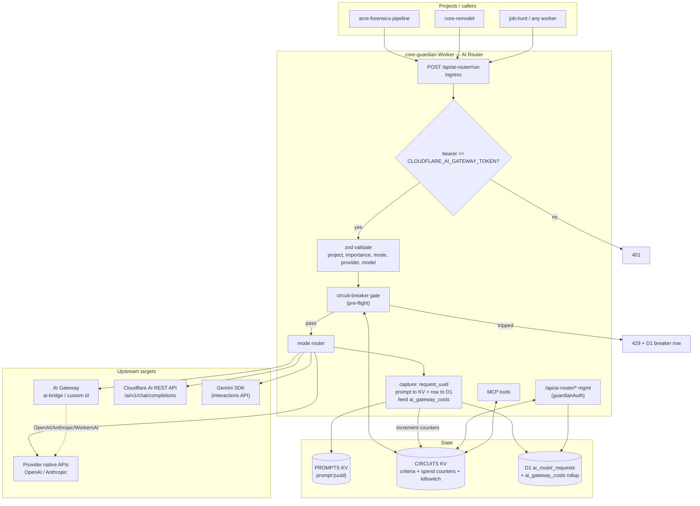
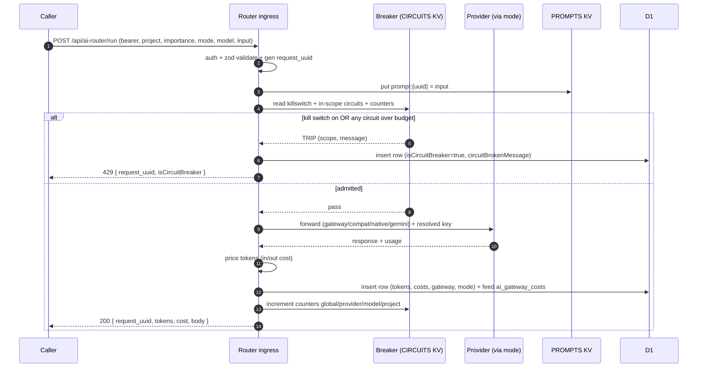
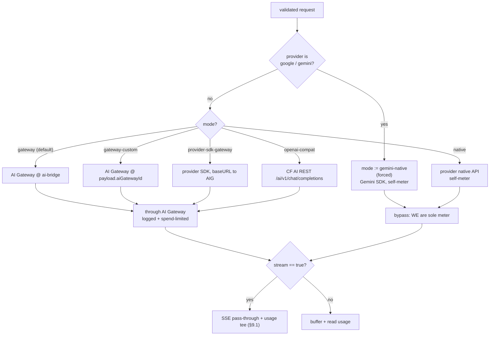
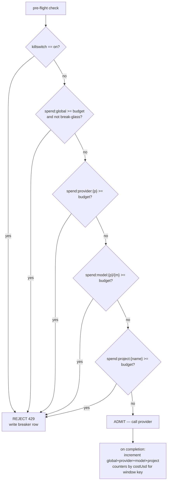
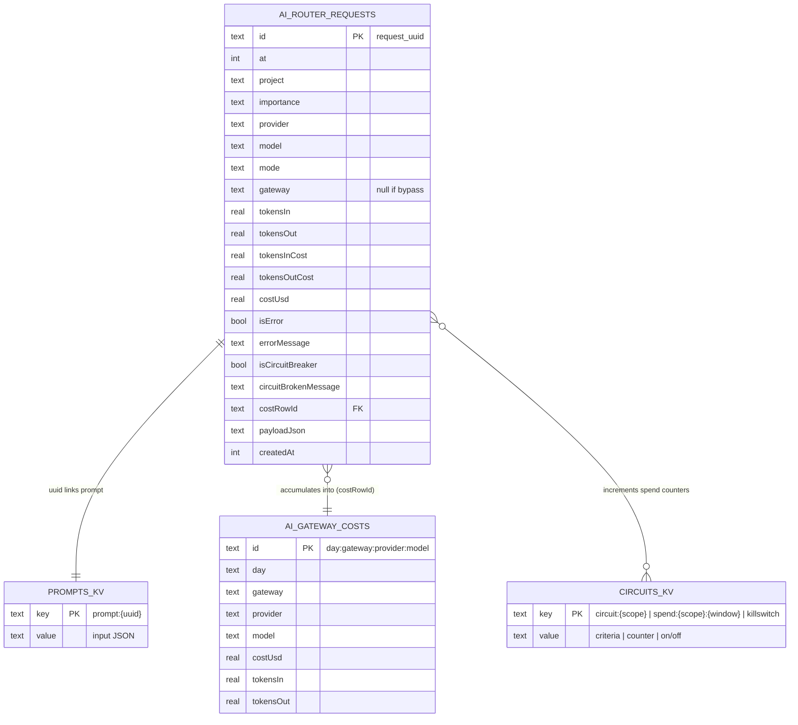
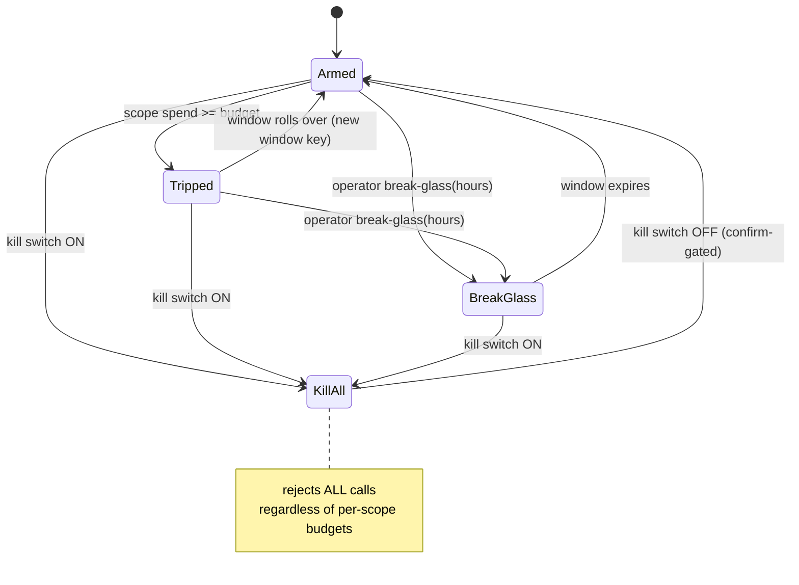

# Spec #1 — AI Router: Routing Core (design)

**Status:** design, awaiting user review (2026-08-11).
**Umbrella:** see [2026-08-10-ai-router-overview.md](./2026-08-10-ai-router-overview.md) for decomposition, reuse map, and specs #2–4 skeletons.
**Scope:** the request hot path — ingress auth, mode-based routing to AI Gateway / compat / native, per-request metadata capture (KV prompt + D1 row), hierarchical circuit breakers + kill switch, and the management API/MCP surface. Frontend is spec #2.

---

## 1. Goal & non-goals

**Goal:** one Worker endpoint that every project calls for AI inference. It routes each call (default: through AI Gateway `ai-bridge`), meters it in KV (fast) + D1 (durable), and refuses calls that would breach a circuit breaker or the global kill switch — so billable spend is tracked per project/model and can be capped.

**Non-goals (this spec):** the admin UI (#2), project-dimensioned usage charts (#3), Jules recommendations (#4). No per-project API keys — single shared ingress token for now.

**Streaming IS in scope** as an optional per-request capability (`stream: true`) — see §9.1.

---

## 2. Ingress contract

`POST /api/ai-router/run` — router mounted on the existing Hono app, gated by a bearer check against secret `CLOUDFLARE_AI_GATEWAY_TOKEN` (NOT `guardianAuth`; this is the caller-facing inference door, distinct from the admin/session auth used by management routes below).

**Request body:**
```jsonc
{
  // --- required metadata (recorded in D1) ---
  "project": "acre-forensics-pipeline",   // invoking app/worker (required)
  "importance": "low" | "medium" | "high", // criticality of this call (required)

  // --- routing selection ---
  "mode": "gateway",        // default; see §3. optional, defaults to "gateway"
  "provider": "openai",     // openai | anthropic | google | workers-ai | ...(AIG providers)
  "model": "gpt-5-mini",    // model id as the chosen path expects it
  "aiGatewayId": "…",       // only for mode "gateway-custom"
  "transport": "…",         // optional override; see §3.1. defaults per mode
  "stream": false,          // optional; true → SSE pass-through w/ usage tee (§9.1)
  "providerApiKey": "…",    // optional; overrides the secret-store key for this call

  // --- the actual provider payload ---
  "input": { /* provider-native body OR openai-chat body, per mode */ },

  // any other top-level keys are captured verbatim into payloadJson
}
```

**Validation (zod):** `project` non-empty; `importance` enum; `provider`/`model` non-empty; `mode` enum (default `gateway`); `aiGatewayId` required iff `mode==="gateway-custom"`. Google/Gemini provider is **forced** to `gemini-native` regardless of `mode` (§3).

**Response:**
```jsonc
{ "request_uuid": "…", "status": 200, "provider": "…", "model": "…",
  "mode": "…", "gateway": "ai-bridge" | null,
  "tokens_in": 0, "tokens_out": 0, "cost_usd": 0,
  "body": { /* provider response, verbatim */ } }
```
On breaker/kill-switch rejection: HTTP 429, `{ request_uuid, isCircuitBreaker:true, circuitBrokenMessage:"…" }` — and a D1 row is still written (§5).

---

## 3. Routing modes (LOCKED)

| `mode` | target | default transport | through AIG? | metered by |
|---|---|---|---|---|
| `gateway` *(default, non-Gemini)* | AI Gateway @ `ai-bridge` | CF-recommended (AI SDK via `ai-gateway-provider`) | ✅ | AIG + us |
| `gateway-custom` | AI Gateway @ `payload.aiGatewayId` | CF-recommended | ✅ | AIG + us |
| `provider-sdk-gateway` | AI Gateway @ default | provider's own SDK, `baseURL`→AIG | ✅ | AIG + us |
| `openai-compat` | Cloudflare AI REST API `/ai/v1/chat/completions` (`api.cloudflare.com`) | OpenAI SDK, compat baseURL | ✅ (unified billing) | AIG + us |
| `native` | provider API directly | provider SDK/fetch | ❌ | **us only** |
| `gemini-native` *(forced for all Gemini)* | Gemini API directly (Gemini SDK) | Gemini SDK | ❌ | **us only** |

- **Default gateway id = `ai-bridge`** (created 2026-08-11; logs on). The worker's own internal calls keep using `default-gateway` (wrangler `AI_GATEWAY_ID`) — the router default is separate on purpose.
- **Gemini rule:** per user, treat all Gemini as the interactions-API future; AIG can't proxy it, so `provider: google`/`gemini` always routes `gemini-native` via the Gemini SDK and is self-metered. Revisit when AIG adds interactions support.
- The two `❌` modes are where **we are the sole meter** — breaker enforcement + token capture there is load-bearing, not redundant.

### 3.1 Transport override
`transport` lets the caller pick *how* a mode executes, defaulting to the CF-recommended path for that mode:
- `ai-sdk` (default for gateway modes) — `ai-gateway-provider` + Vercel AI SDK.
- `provider-sdk` — the provider's own SDK with `baseURL` set to the AIG endpoint.
- `openai-compat` — OpenAI SDK pointed at the Cloudflare AI REST compat URL.
- `gemini-sdk` — Gemini SDK (implicit/forced for Gemini).
Invalid mode×transport combos are rejected at validation with a clear message.

### 3.2 Auth to each target
- **AIG modes:** `cf-aig-authorization: Bearer {CLOUDFLARE_AI_GATEWAY_TOKEN}` + `Authorization: Bearer {providerKey}`.
- **openai-compat (CF REST):** `Authorization: Bearer {cfToken}` (unified billing). `cfToken` = `CLOUDFLARE_AI_GATEWAY_TOKEN` (only CF token currently bound). ⚠️ The `/ai/v1/*` REST API may require a scoped Cloudflare **API token**, not the gateway token — verify at build; if rejected, add a `CLOUDFLARE_API_TOKEN` secret. If caller supplies `providerApiKey`, use BYOK semantics instead.
- **native / gemini-native:** `{providerKey}` only.
- **providerKey resolution:** `payload.providerApiKey` if present, else the **existing** secret-store binding per provider — `OPENAI_API_KEY`, `ANTHROPIC_API_KEY`, `GEMINI_API_KEY` (google/gemini). Missing key for the chosen provider → 400.

---

## 4. Provider registry

A single `providers` module maps `provider → { aigSlug, nativeBaseUrl, sdkFactory, usageExtractor, keyBinding }` where `keyBinding` ∈ `OPENAI_API_KEY | ANTHROPIC_API_KEY | GEMINI_API_KEY`. Reuses the `usage` extractors already in `ai-proxy.ts` (openai `prompt_tokens/completion_tokens`, anthropic `input_tokens/output_tokens`, google `usageMetadata`). One place to add a provider; each mode reads from it. Keeps the router file small and each provider testable in isolation.

---

## 5. Metadata capture (every request, all modes)

1. Generate `request_uuid` (`crypto.randomUUID()`).
2. **Prompt → KV** (`PROMPTS` namespace): key `prompt:{request_uuid}` = the full input/prompt JSON. TTL configurable (default none / long). Separated from D1 so large prompts don't bloat the relational store and are cheap to sample (spec #4).
3. **D1 row → new table `ai_router_requests`** (§6): uuid, timestamps, project, importance, provider, model, mode, gateway, tokens_in, tokens_out, tokens_in_cost, tokens_out_cost, isError, errorMessage, isCircuitBreaker, circuitBrokenMessage, payloadJson (extra non-required top-level keys).
4. **Feed the existing roll-up:** call `registerDirectUsage` (or a shared internal) so the call also accumulates into `ai_gateway_costs` — keeping today's cost/drift/pricing/usage queries working unchanged. Gateway tag = the actual gateway id for AIG modes, or `router-native`/`router-gemini` for bypass modes.
5. Pricing: reuse `ai-proxy.ts` price map / `calculateCosts` to split `tokens_in_cost` vs `tokens_out_cost`.

Capture happens even on error and on breaker rejection (with the provider call skipped), so the D1 trail is complete.

---

## 6. New D1 table `ai_router_requests`

Drizzle schema under `src/backend/db/schemas/governance/ai-router-requests.ts` (follows the file's existing doc-constant + insert/select-schema pattern):

| column | type | notes |
|---|---|---|
| id | text pk | = request_uuid |
| at | integer | unix ms request received |
| project | text notNull | indexed |
| importance | text notNull | low\|medium\|high |
| provider | text notNull | |
| model | text notNull | indexed |
| mode | text notNull | routing mode used |
| gateway | text | AIG id, or null for bypass modes |
| tokensIn | real notNull default 0 | |
| tokensOut | real notNull default 0 | |
| tokensInCost | real notNull default 0 | |
| tokensOutCost | real notNull default 0 | |
| costUsd | real notNull default 0 | tokensInCost+tokensOutCost |
| isError | integer(bool) default false | |
| errorMessage | text | |
| isCircuitBreaker | integer(bool) default false | |
| circuitBrokenMessage | text | which breaker + why |
| costRowId | text | the ai_gateway_costs row it fed |
| payloadJson | text | JSON of top-level keys NOT in the known set {project, importance, mode, provider, model, aiGatewayId, transport, providerApiKey, input} |
| createdAt | integer | |

Indexes: `(project)`, `(model)`, `(at)`. Migration via `pnpm run db:generate` (cloudflare-jedi Drizzle flow).

---

## 7. Circuit breakers + kill switch

### 7.1 Storage
- **Criteria** in dedicated **`CIRCUITS` KV** (low-latency read on every request). Two key shapes:
  - `killswitch` = `"on" | "off"` (global).
  - `circuit:{scope}` where scope ∈ `global` | `provider:{p}` | `model:{p}/{m}` | `project:{name}`. Value: `{ budgetUsd, window: "day"|"week"|"month"|"total", enabled, breakGlassUntil? }`.
- **Spend counters** in **`CIRCUITS` KV** too: `spend:{scope}:{windowKey}` (e.g. `spend:project:acre:2026-08`). Fast read-modify-write, same pattern as `ai-proxy.ts` monthly counter (with its documented non-atomicity caveat — soft governor; D1 is the exact trail).
- **Durable trail** in D1 `ai_router_requests` — a reconcile query can rebuild any KV counter from D1 if KV drifts/expires.

### 7.2 Evaluation (pre-flight, first trip wins)
Order, cheapest/broadest first:
1. **Kill switch** on → reject all. `circuitBrokenMessage="kill switch active"`.
2. **Global total** spend ≥ budget (unless in break-glass) → reject.
3. **provider:{p}** cap → reject.
4. **model:{p}/{m}** cap (e.g. gpt-oss-120b $50/mo) → reject.
5. **project:{name}** cap → reject.
Each check: read criteria + current counter from KV, compare, on breach return 429 + write D1 row (isCircuitBreaker=true), never touch the provider. Break-glass window (per scope) overrides that scope's cap, reusing `ai-proxy.ts breakGlass`.

### 7.3 Post-call accounting
After a successful (or errored-but-billed) call, increment every in-scope counter (`global`, `provider:{p}`, `model:{p}/{m}`, `project:{name}`) by `costUsd` for the current window key. Windows: `day`/`week`/`month` derived from `at` (UTC; `week` = ISO-8601 week `YYYY-Www`), `total` = no window suffix.

---

## 8. Management surface (API + MCP)

New router `src/backend/api/routes/ai-router.ts` (OpenAPIHono, **`guardianAuth`**-gated — admin auth, not the inference token):
- `GET /api/ai-router/circuits` — list criteria + current spend per scope.
- `PUT /api/ai-router/circuits/{scope}` — upsert a circuit (budget, window, enabled).
- `DELETE /api/ai-router/circuits/{scope}` — remove.
- `POST /api/ai-router/kill-switch` — `{ on: boolean }`. Confirm-gated when turning **off** (raises exposure), like the spending-limit route pattern.
- `POST /api/ai-router/circuits/{scope}/break-glass` — `{ hours }`.
- `GET /api/ai-router/requests` — recent D1 rows, filterable by project/model/isError/isCircuitBreaker (feeds #3).

MCP tools (in `routes/mcp.ts`, existing registry): `ai_router_kill_switch` (on/off), `ai_router_list_circuits`, `ai_router_set_circuit`, `ai_router_recent_requests`. Every mutation writes a `billing_events` audit row (existing pattern).

---

## 9. Error handling & edge cases

- Provider/network error → capture with `isError=true` + `errorMessage`, return the upstream status; still meter tokens if the response carried `usage`.
- Unknown model for pricing → cost recorded 0, `priced:"unmatched"` (as `register-usage.ts` already does), call NOT blocked.
- KV counter miss/expiry → treat as 0 (fail-open on metering) but the kill switch and any `enabled` circuit with a set budget still evaluate; a reconcile job (later) can rebuild from D1.
- Missing provider key → 400 before any spend.
### 9.1 Streaming (optional, `stream: true`)
When the caller sets `stream: true`, the router returns an SSE stream to the caller while **tee-ing** the byte stream to accumulate usage:
- Request the provider with usage-in-stream enabled where supported (OpenAI: `stream_options: { include_usage: true }`; Anthropic: `message_delta` carries `usage`; Gemini SDK streaming exposes `usageMetadata` on the final chunk).
- Pipe provider SSE → caller unchanged (via `TransformStream`), and in the same transform parse each chunk to capture the final `usage`. Non-streaming path is unchanged (buffer + read `usage`).
- On stream end (or client disconnect via `signal`), finalize the D1 row + KV counters with whatever usage was captured; if the final usage chunk never arrived, record tokens best-effort (`priced:"unmatched"` if unknown) and mark the row so it can be reconciled.
- **Breaker interaction:** breakers evaluate *pre-flight* (before the stream opens), so a streamed call is admitted or 429'd exactly like a buffered one; post-stream accounting increments counters. A stream already in flight is never interrupted mid-response by a breaker.
- Breaker rejection itself is always a plain JSON 429 (never a stream).

## 10. Testing

- Pure units (assert-based `import.meta.main` self-checks, matching `ai-proxy.ts`): mode×transport validation, provider-key resolution precedence, breaker evaluation order + window-key derivation, price split.
- One integration-ish test per bypass mode with a mocked provider fetch asserting a D1 row + KV counter increment.
- Verify with build + oxlint (NOT `pnpm check` — oxfmt rewrites tree, see [[pnpm-check-reformats]]).

## 11. Bindings (wrangler.jsonc)
- **New KV namespaces (create both):** `PROMPTS` (prompt bodies) + `CIRCUITS` (breaker criteria + fast spend counters). **Leave `SESSIONS` untouched — it's used by Astro.** No prefix-sharing.
- **Secrets — all already bound, none to add:** `OPENAI_API_KEY`, `ANTHROPIC_API_KEY`, `GEMINI_API_KEY`, `CLOUDFLARE_AI_GATEWAY_TOKEN`.
- **Possible follow-up:** `CLOUDFLARE_API_TOKEN` only if the `/ai/v1/*` REST API rejects the gateway token (§3.2) — verify at build, don't pre-add.

## 12. Reuse summary
`ai-proxy.ts` → price map, `priceCall`, `monthKey`, `breakGlass`, provider `usage` extractors. `register-usage.ts` → `registerDirectUsage` roll-up feed. `ai-gateway.ts`/`ai-gateway-admin.ts` route+MCP patterns. `billing_events` audit. cloudflare-jedi stack conventions throughout.

---

## 13. Diagrams

### 13.1 System architecture (component view)



### 13.2 Request lifecycle (happy path, non-streaming)



### 13.3 Mode routing decision



### 13.4 Circuit-breaker evaluation (first trip wins)



### 13.5 Data model



### 13.6 Kill switch / breaker states



